# 技術設計書 — HonTalk（本トーク）

> **SNS機能付き読書記録アプリ**
> ドキュメントバージョン: 1.0
> 作成日: 2026-06-26
> ステータス: ドラフト
> 関連文書: [要件定義書](file:///Users/yokoyamahiroyuki/Desktop/HonTalk/要件定義書.md)

---

## 1. 技術スタック選定

### 1.1 選定結果サマリー

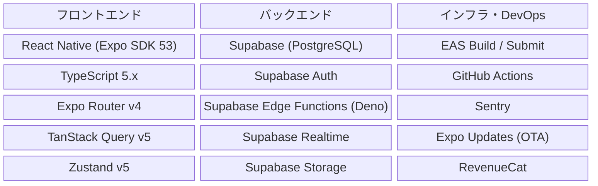

### 1.2 BaaS選定: Supabase を採用

要件定義書では Firebase / Supabase の両方が候補に挙がっていたが、以下の理由から **Supabase** を推奨する。

| 比較項目 | Firebase | Supabase | 選定理由 |
|---------|----------|----------|---------|
| データベース | Firestore (NoSQL) | PostgreSQL (RDB) | SNSアプリではリレーションが複雑。RDBの方がデータ整合性の維持・複雑なクエリに有利 |
| 認証 | Firebase Auth | Supabase Auth (GoTrue) | 両方同等。Supabase はメール/Google/Apple をネイティブサポート |
| リアルタイム | Firestore Realtime | Supabase Realtime | 両方対応。Supabase はPostgreSQLの変更をリアルタイムに配信 |
| セキュリティ | Security Rules (独自DSL) | Row Level Security (SQL) | RLSはSQL標準でより柔軟。個人開発で学習コスト低 |
| コスト | 従量課金 | 無料枠が大きい + 従量課金 | 個人開発ではSupabaseの方がコストメリット大 |
| Edge Functions | Cloud Functions (Node.js) | Edge Functions (Deno) | Denoの方が軽量。コールドスタートが速い |
| マイグレーション | 困難 | 容易（標準SQL） | 将来の移行リスクが低い |

> [!TIP]
> Supabaseは標準SQLベースのため、将来的にセルフホスティングや他のPostgreSQL環境への移行が容易。個人開発でのベンダーロックインリスクを最小化できる。

### 1.3 主要ライブラリ一覧

#### フロントエンド

| パッケージ | バージョン | 用途 |
|-----------|----------|------|
| `expo` | ~53.x | Expo フレームワーク |
| `expo-router` | ~4.x | ファイルベースルーティング |
| `react-native` | ~0.76.x | UIフレームワーク |
| `typescript` | ~5.x | 型安全 |
| `@tanstack/react-query` | ~5.x | サーバーステート管理・キャッシュ |
| `zustand` | ~5.x | クライアントステート管理 |
| `@supabase/supabase-js` | ~2.x | Supabase クライアント |
| `react-native-reanimated` | ~3.x | アニメーション |
| `expo-image` | ~2.x | 高性能画像表示（キャッシュ内蔵） |
| `expo-secure-store` | ~14.x | セキュアストレージ |
| `react-native-safe-area-context` | ~5.x | セーフエリア対応 |
| `zod` | ~3.x | バリデーション（フォーム・API型） |
| `react-hook-form` | ~7.x | フォーム管理 |
| `date-fns` | ~4.x | 日付操作 |

#### Phase 2以降で追加

| パッケージ | 用途 | Phase |
|-----------|------|-------|
| `react-native-chart-kit` / `victory-native` | グラフ表示 | Phase 2 |
| `expo-notifications` | プッシュ通知 | Phase 2 |
| `expo-camera` | バーコードスキャン | Phase 3 |
| `react-native-google-mobile-ads` | AdMob広告 | Phase 3 |
| `react-native-purchases` (RevenueCat) | アプリ内課金 | Phase 3 |

---

## 2. システムアーキテクチャ

### 2.1 全体構成図

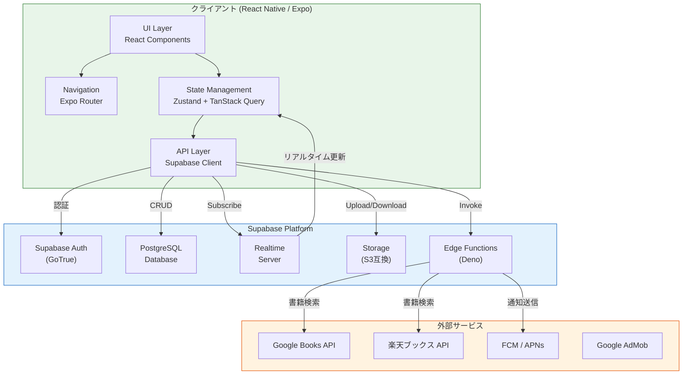

### 2.2 レイヤードアーキテクチャ

```mermaid
graph LR
    subgraph Presentation["Presentation Layer"]
        Screens["Screens"]
        Components["Components"]
    end

    subgraph Application["Application Layer"]
        Hooks["Custom Hooks"]
        Stores["Zustand Stores"]
        Queries["TanStack Queries"]
    end

    subgraph Domain["Domain Layer"]
        Types["Types / Interfaces"]
        Validators["Validators (Zod)"]
        Utils["Utilities"]
    end

    subgraph Infrastructure["Infrastructure Layer"]
        SupaClient["Supabase Client"]
        BookAPI["Book API Service"]
        StorageService["Storage Service"]
        NotifService["Notification Service"]
    end

    Presentation --> Application
    Application --> Domain
    Application --> Infrastructure
    Infrastructure --> Domain

    style Presentation fill:#FFEBEE,stroke:#C62828
    style Application fill:#E8F5E9,stroke:#2E7D32
    style Domain fill:#E3F2FD,stroke:#1565C0
    style Infrastructure fill:#FFF3E0,stroke:#E65100
```

---

## 3. プロジェクトディレクトリ構成

```
HonTalk/
├── app/                          # Expo Router: 画面定義
│   ├── _layout.tsx               # ルートレイアウト
│   ├── index.tsx                 # エントリ（リダイレクト）
│   ├── (auth)/                   # 認証画面グループ
│   │   ├── _layout.tsx
│   │   ├── login.tsx
│   │   ├── register.tsx
│   │   └── forgot-password.tsx
│   ├── (tabs)/                   # メインタブグループ
│   │   ├── _layout.tsx           # タブナビゲーション
│   │   ├── index.tsx             # ホーム（タイムライン）
│   │   ├── search.tsx            # 書籍検索
│   │   ├── notifications.tsx     # 通知
│   │   └── profile.tsx           # マイプロフィール
│   ├── book/
│   │   └── [id].tsx              # 書籍詳細
│   ├── review/
│   │   ├── [id].tsx              # レビュー詳細
│   │   └── create.tsx            # レビュー作成
│   ├── user/
│   │   └── [id].tsx              # ユーザープロフィール
│   └── settings/
│       ├── index.tsx             # 設定トップ
│       ├── account.tsx           # アカウント設定
│       └── privacy.tsx           # プライバシー設定
│
├── src/
│   ├── components/               # 再利用可能コンポーネント
│   │   ├── ui/                   # 汎用UIコンポーネント
│   │   │   ├── Button.tsx
│   │   │   ├── Input.tsx
│   │   │   ├── Avatar.tsx
│   │   │   ├── Card.tsx
│   │   │   ├── Modal.tsx
│   │   │   ├── StarRating.tsx
│   │   │   └── LoadingSpinner.tsx
│   │   ├── book/                 # 書籍関連コンポーネント
│   │   │   ├── BookCard.tsx
│   │   │   ├── BookSearchResult.tsx
│   │   │   └── BookCover.tsx
│   │   ├── review/               # レビュー関連コンポーネント
│   │   │   ├── ReviewCard.tsx
│   │   │   ├── ReviewForm.tsx
│   │   │   └── SpoilerGuard.tsx
│   │   ├── timeline/             # タイムライン関連
│   │   │   ├── TimelineItem.tsx
│   │   │   └── TimelineFeed.tsx
│   │   └── social/               # SNS関連コンポーネント
│   │       ├── FollowButton.tsx
│   │       ├── LikeButton.tsx
│   │       ├── CommentSection.tsx
│   │       └── UserListItem.tsx
│   │
│   ├── hooks/                    # カスタムフック
│   │   ├── useAuth.ts
│   │   ├── useBooks.ts
│   │   ├── useReviews.ts
│   │   ├── useTimeline.ts
│   │   ├── useFollow.ts
│   │   ├── useNotifications.ts
│   │   └── useReadingRecord.ts
│   │
│   ├── stores/                   # Zustand ストア
│   │   ├── authStore.ts
│   │   ├── uiStore.ts
│   │   └── settingsStore.ts
│   │
│   ├── services/                 # 外部サービス連携
│   │   ├── supabase.ts           # Supabase クライアント初期化
│   │   ├── bookApi.ts            # 書籍API抽象化レイヤー
│   │   ├── googleBooksApi.ts     # Google Books API
│   │   ├── rakutenBooksApi.ts    # 楽天ブックス API
│   │   └── storageService.ts     # 画像アップロード
│   │
│   ├── types/                    # TypeScript 型定義
│   │   ├── database.types.ts     # Supabase自動生成型
│   │   ├── book.ts
│   │   ├── user.ts
│   │   ├── review.ts
│   │   ├── timeline.ts
│   │   └── api.ts
│   │
│   ├── validators/               # Zod スキーマ
│   │   ├── auth.ts
│   │   ├── review.ts
│   │   ├── book.ts
│   │   └── profile.ts
│   │
│   ├── utils/                    # ユーティリティ
│   │   ├── constants.ts
│   │   ├── helpers.ts
│   │   ├── dateUtils.ts
│   │   └── errorHandler.ts
│   │
│   ├── theme/                    # デザインテーマ
│   │   ├── colors.ts
│   │   ├── typography.ts
│   │   ├── spacing.ts
│   │   └── index.ts
│   │
│   └── config/                   # 設定
│       ├── env.ts                # 環境変数
│       └── queryClient.ts        # TanStack Query 設定
│
├── supabase/                     # Supabase ローカル開発
│   ├── config.toml               # Supabase CLI 設定
│   ├── migrations/               # DBマイグレーション
│   │   ├── 00001_create_users.sql
│   │   ├── 00002_create_books.sql
│   │   ├── 00003_create_reading_records.sql
│   │   ├── 00004_create_reviews.sql
│   │   ├── 00005_create_social.sql
│   │   ├── 00006_create_shelves.sql
│   │   ├── 00007_create_notifications.sql
│   │   └── 00008_create_rls_policies.sql
│   ├── functions/                # Edge Functions
│   │   ├── search-books/
│   │   ├── send-notification/
│   │   └── calculate-ranking/
│   └── seed.sql                  # 開発用シードデータ
│
├── assets/                       # 静的アセット
│   ├── images/
│   ├── fonts/
│   └── animations/               # Lottieアニメーション等
│
├── __tests__/                    # テスト
│   ├── unit/
│   ├── integration/
│   └── e2e/
│
├── .github/
│   └── workflows/
│       ├── ci.yml                # CI パイプライン
│       ├── preview.yml           # PRプレビュー
│       └── release.yml           # リリース
│
├── app.json                      # Expo 設定
├── tsconfig.json
├── package.json
├── .env.local                    # ローカル環境変数
├── .env.staging                  # ステージング環境変数
├── .env.production               # 本番環境変数
└── eas.json                      # EAS ビルド設定
```

---

## 4. データベース設計（詳細）

### 4.1 テーブル定義（DDL）

> [!NOTE]
> Supabase Authが `auth.users` テーブルを自動管理するため、`public.profiles` テーブルで拡張プロフィール情報を保持する。`auth.users.id` を外部キーとして参照する。

#### profiles テーブル

```sql
-- ユーザープロフィール（auth.usersの拡張）
CREATE TABLE public.profiles (
    id UUID PRIMARY KEY REFERENCES auth.users(id) ON DELETE CASCADE,
    nickname TEXT NOT NULL UNIQUE,
    avatar_url TEXT,
    bio TEXT DEFAULT '',
    favorite_genres TEXT[] DEFAULT '{}',
    privacy_setting TEXT NOT NULL DEFAULT 'public'
        CHECK (privacy_setting IN ('public', 'followers_only', 'private')),
    is_premium BOOLEAN NOT NULL DEFAULT FALSE,
    notification_settings JSONB NOT NULL DEFAULT '{
        "like": true,
        "comment": true,
        "follow": true,
        "recommend": true,
        "dm": true
    }',
    created_at TIMESTAMPTZ NOT NULL DEFAULT NOW(),
    updated_at TIMESTAMPTZ NOT NULL DEFAULT NOW()
);

-- ニックネーム検索用インデックス
CREATE INDEX idx_profiles_nickname ON public.profiles (nickname);
-- 更新日時の自動更新トリガー
CREATE TRIGGER set_updated_at BEFORE UPDATE ON public.profiles
    FOR EACH ROW EXECUTE FUNCTION update_updated_at_column();
```

#### books テーブル

```sql
-- 書籍マスターデータ
CREATE TABLE public.books (
    id UUID PRIMARY KEY DEFAULT gen_random_uuid(),
    title TEXT NOT NULL,
    author TEXT NOT NULL,
    publisher TEXT,
    isbn TEXT UNIQUE,
    cover_image_url TEXT,
    genre TEXT,
    page_count INTEGER,
    published_date DATE,
    description TEXT,
    google_books_id TEXT UNIQUE,
    rakuten_books_id TEXT UNIQUE,
    average_rating NUMERIC(3, 2) DEFAULT 0,
    rating_count INTEGER DEFAULT 0,
    created_at TIMESTAMPTZ NOT NULL DEFAULT NOW(),
    updated_at TIMESTAMPTZ NOT NULL DEFAULT NOW()
);

-- 検索用インデックス
CREATE INDEX idx_books_title ON public.books USING GIN (to_tsvector('japanese', title));
CREATE INDEX idx_books_author ON public.books USING GIN (to_tsvector('japanese', author));
CREATE INDEX idx_books_isbn ON public.books (isbn);
CREATE INDEX idx_books_genre ON public.books (genre);
```

#### reading_records テーブル

```sql
-- 読書記録
CREATE TABLE public.reading_records (
    id UUID PRIMARY KEY DEFAULT gen_random_uuid(),
    user_id UUID NOT NULL REFERENCES public.profiles(id) ON DELETE CASCADE,
    book_id UUID NOT NULL REFERENCES public.books(id) ON DELETE CASCADE,
    status TEXT NOT NULL DEFAULT 'want_to_read'
        CHECK (status IN ('want_to_read', 'reading', 'finished')),
    rating INTEGER CHECK (rating >= 1 AND rating <= 5),
    start_date DATE,
    end_date DATE,
    created_at TIMESTAMPTZ NOT NULL DEFAULT NOW(),
    updated_at TIMESTAMPTZ NOT NULL DEFAULT NOW(),
    -- 1ユーザー1冊につき1レコード
    UNIQUE (user_id, book_id)
);

CREATE INDEX idx_reading_records_user ON public.reading_records (user_id, status);
CREATE INDEX idx_reading_records_book ON public.reading_records (book_id);
CREATE INDEX idx_reading_records_created ON public.reading_records (created_at DESC);
```

#### reviews テーブル

```sql
-- レビュー・感想
CREATE TABLE public.reviews (
    id UUID PRIMARY KEY DEFAULT gen_random_uuid(),
    user_id UUID NOT NULL REFERENCES public.profiles(id) ON DELETE CASCADE,
    book_id UUID NOT NULL REFERENCES public.books(id) ON DELETE CASCADE,
    reading_record_id UUID REFERENCES public.reading_records(id) ON DELETE SET NULL,
    content TEXT NOT NULL CHECK (char_length(content) <= 5000),
    is_public BOOLEAN NOT NULL DEFAULT TRUE,
    has_spoiler BOOLEAN NOT NULL DEFAULT FALSE,
    like_count INTEGER NOT NULL DEFAULT 0,
    comment_count INTEGER NOT NULL DEFAULT 0,
    created_at TIMESTAMPTZ NOT NULL DEFAULT NOW(),
    updated_at TIMESTAMPTZ NOT NULL DEFAULT NOW()
);

CREATE INDEX idx_reviews_user ON public.reviews (user_id, created_at DESC);
CREATE INDEX idx_reviews_book ON public.reviews (book_id, created_at DESC);
CREATE INDEX idx_reviews_public ON public.reviews (is_public, created_at DESC)
    WHERE is_public = TRUE;
```

#### follows テーブル

```sql
-- フォロー関係
CREATE TABLE public.follows (
    id UUID PRIMARY KEY DEFAULT gen_random_uuid(),
    follower_id UUID NOT NULL REFERENCES public.profiles(id) ON DELETE CASCADE,
    following_id UUID NOT NULL REFERENCES public.profiles(id) ON DELETE CASCADE,
    created_at TIMESTAMPTZ NOT NULL DEFAULT NOW(),
    -- 自分自身のフォロー禁止 + 重複フォロー禁止
    UNIQUE (follower_id, following_id),
    CHECK (follower_id != following_id)
);

CREATE INDEX idx_follows_follower ON public.follows (follower_id);
CREATE INDEX idx_follows_following ON public.follows (following_id);
```

#### likes テーブル

```sql
-- いいね
CREATE TABLE public.likes (
    id UUID PRIMARY KEY DEFAULT gen_random_uuid(),
    user_id UUID NOT NULL REFERENCES public.profiles(id) ON DELETE CASCADE,
    review_id UUID NOT NULL REFERENCES public.reviews(id) ON DELETE CASCADE,
    created_at TIMESTAMPTZ NOT NULL DEFAULT NOW(),
    -- 1ユーザー1レビューに1いいね
    UNIQUE (user_id, review_id)
);

CREATE INDEX idx_likes_review ON public.likes (review_id);
CREATE INDEX idx_likes_user ON public.likes (user_id);
```

#### comments テーブル

```sql
-- コメント
CREATE TABLE public.comments (
    id UUID PRIMARY KEY DEFAULT gen_random_uuid(),
    user_id UUID NOT NULL REFERENCES public.profiles(id) ON DELETE CASCADE,
    review_id UUID NOT NULL REFERENCES public.reviews(id) ON DELETE CASCADE,
    content TEXT NOT NULL CHECK (char_length(content) <= 500),
    created_at TIMESTAMPTZ NOT NULL DEFAULT NOW(),
    updated_at TIMESTAMPTZ NOT NULL DEFAULT NOW()
);

CREATE INDEX idx_comments_review ON public.comments (review_id, created_at ASC);
```

#### shelves / shelf_books テーブル

```sql
-- 本棚
CREATE TABLE public.shelves (
    id UUID PRIMARY KEY DEFAULT gen_random_uuid(),
    user_id UUID NOT NULL REFERENCES public.profiles(id) ON DELETE CASCADE,
    name TEXT NOT NULL,
    is_default BOOLEAN NOT NULL DEFAULT FALSE,
    sort_order INTEGER NOT NULL DEFAULT 0,
    created_at TIMESTAMPTZ NOT NULL DEFAULT NOW(),
    UNIQUE (user_id, name)
);

-- 本棚と書籍の中間テーブル
CREATE TABLE public.shelf_books (
    id UUID PRIMARY KEY DEFAULT gen_random_uuid(),
    shelf_id UUID NOT NULL REFERENCES public.shelves(id) ON DELETE CASCADE,
    book_id UUID NOT NULL REFERENCES public.books(id) ON DELETE CASCADE,
    added_at TIMESTAMPTZ NOT NULL DEFAULT NOW(),
    UNIQUE (shelf_id, book_id)
);

CREATE INDEX idx_shelf_books_shelf ON public.shelf_books (shelf_id);
```

#### notifications テーブル

```sql
-- 通知
CREATE TABLE public.notifications (
    id UUID PRIMARY KEY DEFAULT gen_random_uuid(),
    user_id UUID NOT NULL REFERENCES public.profiles(id) ON DELETE CASCADE,
    actor_id UUID REFERENCES public.profiles(id) ON DELETE SET NULL,
    type TEXT NOT NULL
        CHECK (type IN ('like', 'comment', 'follow', 'recommend', 'system')),
    reference_type TEXT, -- 'review', 'comment', 'book' etc.
    reference_id UUID,
    message TEXT,
    is_read BOOLEAN NOT NULL DEFAULT FALSE,
    created_at TIMESTAMPTZ NOT NULL DEFAULT NOW()
);

CREATE INDEX idx_notifications_user ON public.notifications (user_id, is_read, created_at DESC);
```

#### messages テーブル（Phase 3）

```sql
-- ダイレクトメッセージ
CREATE TABLE public.messages (
    id UUID PRIMARY KEY DEFAULT gen_random_uuid(),
    sender_id UUID NOT NULL REFERENCES public.profiles(id) ON DELETE CASCADE,
    receiver_id UUID NOT NULL REFERENCES public.profiles(id) ON DELETE CASCADE,
    content TEXT NOT NULL CHECK (char_length(content) <= 2000),
    is_read BOOLEAN NOT NULL DEFAULT FALSE,
    created_at TIMESTAMPTZ NOT NULL DEFAULT NOW(),
    CHECK (sender_id != receiver_id)
);

CREATE INDEX idx_messages_conversation ON public.messages (
    LEAST(sender_id, receiver_id),
    GREATEST(sender_id, receiver_id),
    created_at DESC
);
CREATE INDEX idx_messages_receiver ON public.messages (receiver_id, is_read);
```

#### blocks / reports テーブル

```sql
-- ブロック
CREATE TABLE public.blocks (
    id UUID PRIMARY KEY DEFAULT gen_random_uuid(),
    blocker_id UUID NOT NULL REFERENCES public.profiles(id) ON DELETE CASCADE,
    blocked_id UUID NOT NULL REFERENCES public.profiles(id) ON DELETE CASCADE,
    created_at TIMESTAMPTZ NOT NULL DEFAULT NOW(),
    UNIQUE (blocker_id, blocked_id),
    CHECK (blocker_id != blocked_id)
);

-- 通報
CREATE TABLE public.reports (
    id UUID PRIMARY KEY DEFAULT gen_random_uuid(),
    reporter_id UUID NOT NULL REFERENCES public.profiles(id) ON DELETE CASCADE,
    target_type TEXT NOT NULL CHECK (target_type IN ('user', 'review', 'comment')),
    target_id UUID NOT NULL,
    category TEXT NOT NULL
        CHECK (category IN ('spam', 'inappropriate', 'harassment', 'other')),
    description TEXT,
    status TEXT NOT NULL DEFAULT 'pending'
        CHECK (status IN ('pending', 'reviewing', 'resolved', 'dismissed')),
    created_at TIMESTAMPTZ NOT NULL DEFAULT NOW()
);
```

#### 共通関数

```sql
-- updated_at 自動更新関数
CREATE OR REPLACE FUNCTION update_updated_at_column()
RETURNS TRIGGER AS $$
BEGIN
    NEW.updated_at = NOW();
    RETURN NEW;
END;
$$ LANGUAGE plpgsql;
```

### 4.2 主要ビュー・関数

```sql
-- タイムライン取得関数
CREATE OR REPLACE FUNCTION get_timeline(
    p_user_id UUID,
    p_limit INTEGER DEFAULT 20,
    p_cursor TIMESTAMPTZ DEFAULT NOW()
)
RETURNS TABLE (
    review_id UUID,
    reviewer_id UUID,
    reviewer_nickname TEXT,
    reviewer_avatar TEXT,
    book_id UUID,
    book_title TEXT,
    book_cover TEXT,
    book_author TEXT,
    content TEXT,
    rating INTEGER,
    has_spoiler BOOLEAN,
    like_count INTEGER,
    comment_count INTEGER,
    is_liked BOOLEAN,
    created_at TIMESTAMPTZ
) AS $$
BEGIN
    RETURN QUERY
    SELECT
        r.id AS review_id,
        r.user_id AS reviewer_id,
        p.nickname AS reviewer_nickname,
        p.avatar_url AS reviewer_avatar,
        b.id AS book_id,
        b.title AS book_title,
        b.cover_image_url AS book_cover,
        b.author AS book_author,
        r.content,
        rr.rating,
        r.has_spoiler,
        r.like_count,
        r.comment_count,
        EXISTS(
            SELECT 1 FROM public.likes l
            WHERE l.review_id = r.id AND l.user_id = p_user_id
        ) AS is_liked,
        r.created_at
    FROM public.reviews r
    INNER JOIN public.profiles p ON p.id = r.user_id
    INNER JOIN public.books b ON b.id = r.book_id
    LEFT JOIN public.reading_records rr ON rr.id = r.reading_record_id
    WHERE r.is_public = TRUE
      AND r.created_at < p_cursor
      AND r.user_id IN (
          SELECT following_id FROM public.follows WHERE follower_id = p_user_id
          UNION
          SELECT p_user_id  -- 自分の投稿も表示
      )
      -- ブロックユーザー除外
      AND r.user_id NOT IN (
          SELECT blocked_id FROM public.blocks WHERE blocker_id = p_user_id
      )
      -- ミュートユーザー除外（Phase 2）
    ORDER BY r.created_at DESC
    LIMIT p_limit;
END;
$$ LANGUAGE plpgsql SECURITY DEFINER;
```

### 4.3 Row Level Security (RLS) ポリシー

```sql
-- すべてのテーブルでRLSを有効化
ALTER TABLE public.profiles ENABLE ROW LEVEL SECURITY;
ALTER TABLE public.books ENABLE ROW LEVEL SECURITY;
ALTER TABLE public.reading_records ENABLE ROW LEVEL SECURITY;
ALTER TABLE public.reviews ENABLE ROW LEVEL SECURITY;
ALTER TABLE public.follows ENABLE ROW LEVEL SECURITY;
ALTER TABLE public.likes ENABLE ROW LEVEL SECURITY;
ALTER TABLE public.comments ENABLE ROW LEVEL SECURITY;
ALTER TABLE public.notifications ENABLE ROW LEVEL SECURITY;

-- profiles: 誰でも閲覧可・自分のみ編集可
CREATE POLICY "profiles_select" ON public.profiles
    FOR SELECT USING (true);
CREATE POLICY "profiles_update" ON public.profiles
    FOR UPDATE USING (auth.uid() = id);

-- books: 誰でも閲覧可・認証ユーザーが登録可
CREATE POLICY "books_select" ON public.books
    FOR SELECT USING (true);
CREATE POLICY "books_insert" ON public.books
    FOR INSERT WITH CHECK (auth.role() = 'authenticated');

-- reading_records: 自分のレコードのみCRUD
CREATE POLICY "reading_records_select" ON public.reading_records
    FOR SELECT USING (auth.uid() = user_id);
CREATE POLICY "reading_records_insert" ON public.reading_records
    FOR INSERT WITH CHECK (auth.uid() = user_id);
CREATE POLICY "reading_records_update" ON public.reading_records
    FOR UPDATE USING (auth.uid() = user_id);
CREATE POLICY "reading_records_delete" ON public.reading_records
    FOR DELETE USING (auth.uid() = user_id);

-- reviews: 公開レビューは誰でも閲覧可・自分のみ編集削除
CREATE POLICY "reviews_select" ON public.reviews
    FOR SELECT USING (is_public = TRUE OR auth.uid() = user_id);
CREATE POLICY "reviews_insert" ON public.reviews
    FOR INSERT WITH CHECK (auth.uid() = user_id);
CREATE POLICY "reviews_update" ON public.reviews
    FOR UPDATE USING (auth.uid() = user_id);
CREATE POLICY "reviews_delete" ON public.reviews
    FOR DELETE USING (auth.uid() = user_id);

-- notifications: 自分の通知のみ閲覧可
CREATE POLICY "notifications_select" ON public.notifications
    FOR SELECT USING (auth.uid() = user_id);
CREATE POLICY "notifications_update" ON public.notifications
    FOR UPDATE USING (auth.uid() = user_id);
```

---

## 5. API設計

### 5.1 Supabase Client API（クライアント直接アクセス）

RLSで保護されたテーブルに対して、`supabase-js` クライアントから直接CRUD操作を行う。

| リソース | メソッド | 操作 | RLS |
|---------|---------|------|-----|
| `profiles` | SELECT | プロフィール取得 | ✅ |
| `profiles` | UPDATE | プロフィール更新 | ✅ 自分のみ |
| `books` | SELECT | 書籍一覧・詳細取得 | ✅ |
| `books` | INSERT | 書籍登録（API取得結果のキャッシュ） | ✅ |
| `reading_records` | SELECT / INSERT / UPDATE / DELETE | 読書記録CRUD | ✅ 自分のみ |
| `reviews` | SELECT / INSERT / UPDATE / DELETE | レビューCRUD | ✅ |
| `follows` | SELECT / INSERT / DELETE | フォロー管理 | ✅ |
| `likes` | SELECT / INSERT / DELETE | いいね管理 | ✅ |
| `comments` | SELECT / INSERT / UPDATE / DELETE | コメントCRUD | ✅ |
| `notifications` | SELECT / UPDATE | 通知取得・既読更新 | ✅ 自分のみ |

### 5.2 Edge Functions API

複雑なビジネスロジックやサードパーティAPI連携は Edge Functions で処理する。

| エンドポイント | メソッド | 概要 | Phase |
|--------------|---------|------|-------|
| `/functions/v1/search-books` | POST | 書籍検索（Google Books + 楽天） | MVP |
| `/functions/v1/get-timeline` | POST | タイムライン取得（DB関数呼び出し） | MVP |
| `/functions/v1/toggle-like` | POST | いいねのトグル + カウント更新 + 通知作成 | MVP |
| `/functions/v1/add-comment` | POST | コメント追加 + カウント更新 + 通知作成 | MVP |
| `/functions/v1/toggle-follow` | POST | フォロー/アンフォロー + 通知作成 | MVP |
| `/functions/v1/send-notification` | POST | プッシュ通知送信 | Phase 2 |
| `/functions/v1/calculate-ranking` | POST | ランキング集計（CRONトリガー） | Phase 2 |
| `/functions/v1/delete-account` | POST | アカウント削除（関連データ全削除） | Phase 2 |

### 5.3 Edge Function 実装例

```typescript
// supabase/functions/search-books/index.ts
import { serve } from "https://deno.land/std@0.177.0/http/server.ts";
import { createClient } from "https://esm.sh/@supabase/supabase-js@2";

interface SearchRequest {
  query: string;
  type: "title" | "author" | "isbn";
  page?: number;
}

interface BookResult {
  title: string;
  author: string;
  publisher?: string;
  isbn?: string;
  coverImageUrl?: string;
  genre?: string;
  pageCount?: number;
  publishedDate?: string;
  description?: string;
  source: "google" | "rakuten";
  sourceId: string;
}

serve(async (req: Request) => {
  const { query, type, page = 1 }: SearchRequest = await req.json();

  // Google Books API と楽天ブックスAPIを並列で検索
  const [googleResults, rakutenResults] = await Promise.allSettled([
    searchGoogleBooks(query, type, page),
    searchRakutenBooks(query, type, page),
  ]);

  // 結果をマージ・重複排除（ISBNベース）
  const merged = mergeResults(
    googleResults.status === "fulfilled" ? googleResults.value : [],
    rakutenResults.status === "fulfilled" ? rakutenResults.value : []
  );

  return new Response(JSON.stringify({ books: merged }), {
    headers: { "Content-Type": "application/json" },
  });
});
```

### 5.4 API レスポンス標準フォーマット

```typescript
// 成功レスポンス
interface ApiSuccessResponse<T> {
  data: T;
  meta?: {
    total?: number;
    page?: number;
    limit?: number;
    cursor?: string;
  };
}

// エラーレスポンス
interface ApiErrorResponse {
  error: {
    code: string;      // 例: "AUTH_001"
    message: string;   // ユーザー向けメッセージ
    details?: string;  // 開発者向け詳細
  };
}
```

---

## 6. 認証フロー設計

### 6.1 メール認証フロー

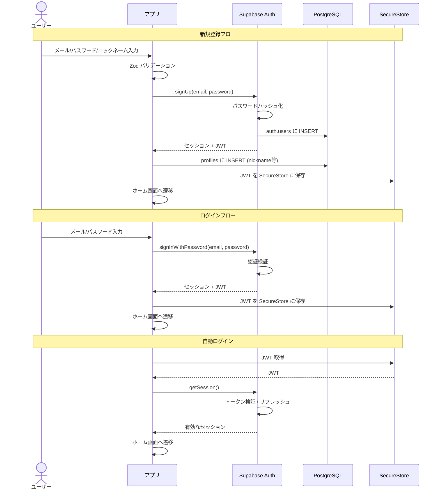

### 6.2 ソーシャルログインフロー

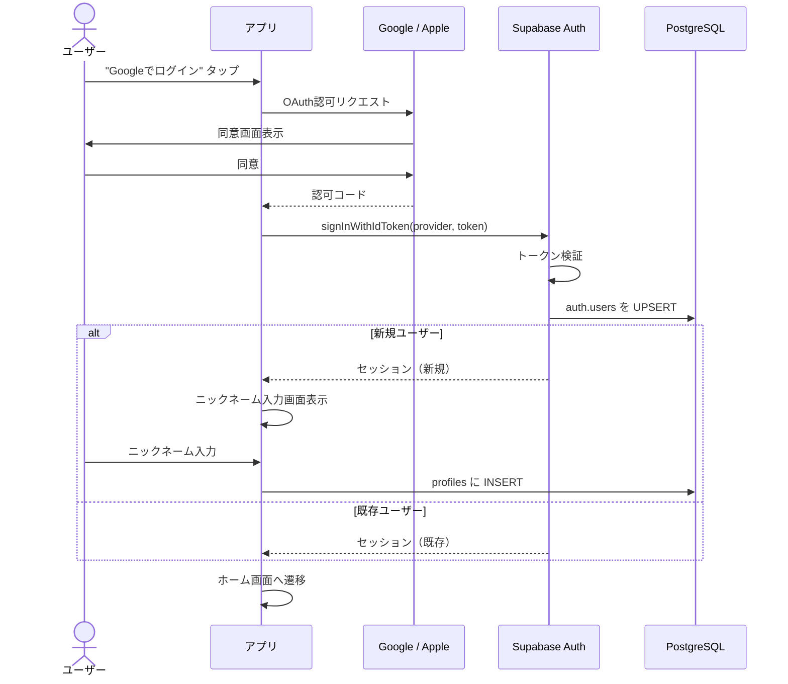

### 6.3 認証クライアント実装

```typescript
// src/services/supabase.ts
import { createClient } from "@supabase/supabase-js";
import * as SecureStore from "expo-secure-store";
import { Database } from "@/types/database.types";

const supabaseUrl = process.env.EXPO_PUBLIC_SUPABASE_URL!;
const supabaseAnonKey = process.env.EXPO_PUBLIC_SUPABASE_ANON_KEY!;

// SecureStore をストレージアダプターとして使用
const ExpoSecureStoreAdapter = {
  getItem: (key: string) => SecureStore.getItemAsync(key),
  setItem: (key: string, value: string) => SecureStore.setItemAsync(key, value),
  removeItem: (key: string) => SecureStore.deleteItemAsync(key),
};

export const supabase = createClient<Database>(supabaseUrl, supabaseAnonKey, {
  auth: {
    storage: ExpoSecureStoreAdapter,
    autoRefreshToken: true,
    persistSession: true,
    detectSessionInUrl: false, // React Native では false
  },
});
```

---

## 7. 状態管理設計

### 7.1 役割分担

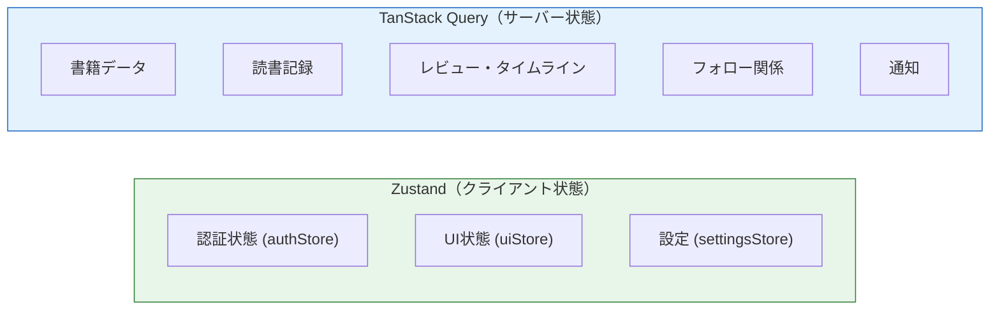

| 管理対象 | ツール | 理由 |
|---------|-------|------|
| 認証セッション | Zustand | グローバルに参照、サーバー同期不要 |
| モーダル・トースト | Zustand | UI状態はサーバーに依存しない |
| テーマ・言語設定 | Zustand + AsyncStorage | 永続化が必要なローカル設定 |
| 書籍・レビュー等 | TanStack Query | サーバーデータのキャッシュ・同期・再取得 |

### 7.2 Zustand Store 実装例

```typescript
// src/stores/authStore.ts
import { create } from "zustand";
import { Session, User } from "@supabase/supabase-js";

interface Profile {
  id: string;
  nickname: string;
  avatarUrl: string | null;
  bio: string;
  isPremium: boolean;
}

interface AuthState {
  session: Session | null;
  user: User | null;
  profile: Profile | null;
  isLoading: boolean;
  setSession: (session: Session | null) => void;
  setProfile: (profile: Profile | null) => void;
  setLoading: (loading: boolean) => void;
  reset: () => void;
}

export const useAuthStore = create<AuthState>((set) => ({
  session: null,
  user: null,
  profile: null,
  isLoading: true,
  setSession: (session) =>
    set({ session, user: session?.user ?? null }),
  setProfile: (profile) => set({ profile }),
  setLoading: (isLoading) => set({ isLoading }),
  reset: () =>
    set({ session: null, user: null, profile: null, isLoading: false }),
}));
```

### 7.3 TanStack Query Hook 実装例

```typescript
// src/hooks/useTimeline.ts
import { useInfiniteQuery, useMutation, useQueryClient } from "@tanstack/react-query";
import { supabase } from "@/services/supabase";
import { useAuthStore } from "@/stores/authStore";

const TIMELINE_PAGE_SIZE = 20;

export function useTimeline() {
  const userId = useAuthStore((s) => s.user?.id);

  return useInfiniteQuery({
    queryKey: ["timeline", userId],
    queryFn: async ({ pageParam }) => {
      const { data, error } = await supabase.rpc("get_timeline", {
        p_user_id: userId!,
        p_limit: TIMELINE_PAGE_SIZE,
        p_cursor: pageParam,
      });
      if (error) throw error;
      return data;
    },
    initialPageParam: new Date().toISOString(),
    getNextPageParam: (lastPage) => {
      if (lastPage.length < TIMELINE_PAGE_SIZE) return undefined;
      return lastPage[lastPage.length - 1].created_at;
    },
    enabled: !!userId,
    staleTime: 1000 * 60, // 1分間キャッシュ
  });
}

export function useToggleLike() {
  const queryClient = useQueryClient();

  return useMutation({
    mutationFn: async (reviewId: string) => {
      const { data, error } = await supabase.functions.invoke("toggle-like", {
        body: { reviewId },
      });
      if (error) throw error;
      return data;
    },
    onSuccess: () => {
      // タイムラインとレビュー詳細のキャッシュを無効化
      queryClient.invalidateQueries({ queryKey: ["timeline"] });
      queryClient.invalidateQueries({ queryKey: ["review"] });
    },
  });
}
```

---

## 8. ナビゲーション設計

### 8.1 画面遷移図

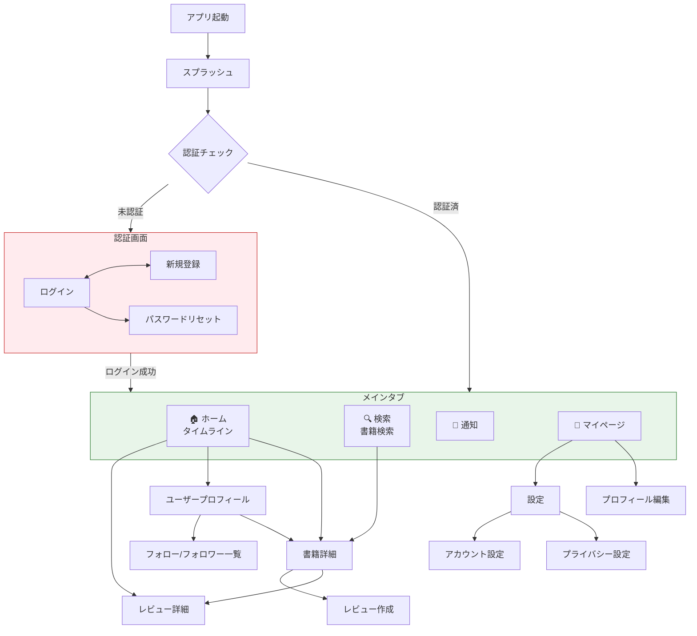

### 8.2 タブ構成

| タブ | アイコン | 画面 | バッジ |
|------|---------|------|-------|
| ホーム | 🏠 `home` | タイムライン | — |
| 検索 | 🔍 `search` | 書籍検索 | — |
| 通知 | 🔔 `bell` | 通知一覧 | 未読数 |
| マイページ | 👤 `user` | 自分のプロフィール | — |

---

## 9. 外部API連携設計

### 9.1 書籍検索の抽象化

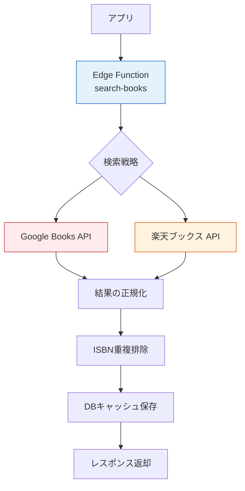

### 9.2 API仕様

#### Google Books API

| 項目 | 内容 |
|------|------|
| エンドポイント | `https://www.googleapis.com/books/v1/volumes` |
| 認証 | APIキー（環境変数） |
| レート制限 | 1,000リクエスト/日（無料枠） |
| 主な使用フィールド | `volumeInfo.title`, `volumeInfo.authors`, `volumeInfo.imageLinks`, `volumeInfo.industryIdentifiers` |

#### 楽天ブックス API

| 項目 | 内容 |
|------|------|
| エンドポイント | `https://app.rakuten.co.jp/services/api/BooksBook/Search/20170404` |
| 認証 | アプリID（環境変数） |
| レート制限 | 1リクエスト/秒 |
| 主な使用フィールド | `title`, `author`, `publisherName`, `isbn`, `largeImageUrl` |

### 9.3 フォールバック戦略

```
1. Google Books API で検索
2. 結果が不足 or エラー → 楽天ブックス API で補完
3. 両方失敗 → ユーザーに手動入力を促す
4. 取得結果は books テーブルにキャッシュ（同一ISBNは重複登録しない）
```

---

## 10. リアルタイム通信設計

### 10.1 Supabase Realtime の利用

| チャネル | イベント | 用途 | Phase |
|---------|---------|------|-------|
| `notifications:{userId}` | INSERT | 新規通知の即座表示 | MVP |
| `reviews` | INSERT | タイムラインのリアルタイム更新 | MVP |
| `messages:{conversationId}` | INSERT | DMのリアルタイム受信 | Phase 3 |

### 10.2 クライアント側の購読実装

```typescript
// src/hooks/useRealtimeNotifications.ts
import { useEffect } from "react";
import { supabase } from "@/services/supabase";
import { useAuthStore } from "@/stores/authStore";
import { useQueryClient } from "@tanstack/react-query";

export function useRealtimeNotifications() {
  const userId = useAuthStore((s) => s.user?.id);
  const queryClient = useQueryClient();

  useEffect(() => {
    if (!userId) return;

    const channel = supabase
      .channel(`notifications:${userId}`)
      .on(
        "postgres_changes",
        {
          event: "INSERT",
          schema: "public",
          table: "notifications",
          filter: `user_id=eq.${userId}`,
        },
        (payload) => {
          // 通知キャッシュを無効化して再取得
          queryClient.invalidateQueries({ queryKey: ["notifications"] });
        }
      )
      .subscribe();

    return () => {
      supabase.removeChannel(channel);
    };
  }, [userId, queryClient]);
}
```

---

## 11. プッシュ通知アーキテクチャ（Phase 2）

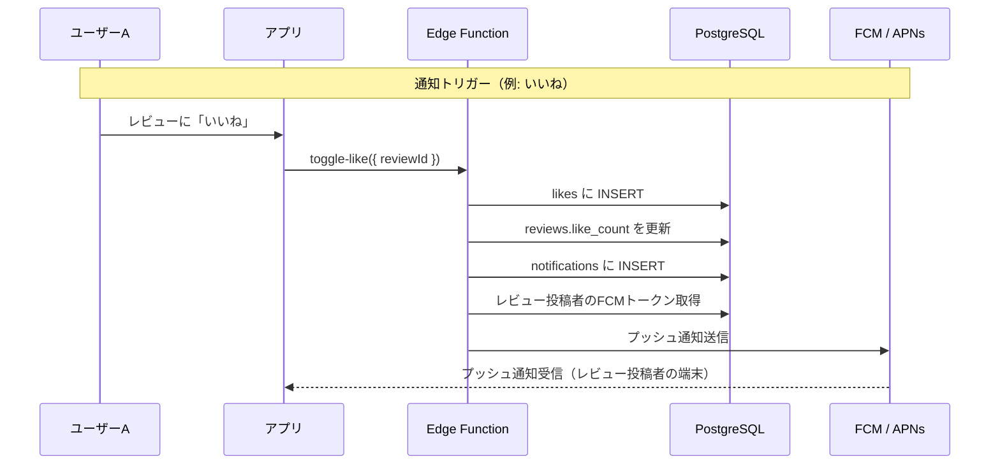

### 11.1 FCMトークン管理

```sql
-- デバイストークンテーブル
CREATE TABLE public.device_tokens (
    id UUID PRIMARY KEY DEFAULT gen_random_uuid(),
    user_id UUID NOT NULL REFERENCES public.profiles(id) ON DELETE CASCADE,
    token TEXT NOT NULL,
    platform TEXT NOT NULL CHECK (platform IN ('ios', 'android', 'web')),
    created_at TIMESTAMPTZ NOT NULL DEFAULT NOW(),
    updated_at TIMESTAMPTZ NOT NULL DEFAULT NOW(),
    UNIQUE (user_id, token)
);
```

---

## 12. 画像ストレージ設計

### 12.1 Supabase Storage バケット構成

| バケット名 | 用途 | アクセス | サイズ制限 |
|-----------|------|---------|----------|
| `avatars` | プロフィール画像 | Public（読み取り）| 2MB |
| `book-covers` | 手動登録時の書籍表紙 | Public（読み取り）| 5MB |
| `review-images` | レビュー添付画像（将来） | Public（読み取り）| 5MB |

### 12.2 画像リサイズ戦略

```typescript
// 画像アップロード時にリサイズ
const AVATAR_SIZE = { width: 200, height: 200 };
const BOOK_COVER_SIZE = { width: 400, height: 600 };

// expo-image-manipulator を使用
import * as ImageManipulator from "expo-image-manipulator";

async function resizeAndUpload(
  uri: string,
  bucket: string,
  path: string,
  size: { width: number; height: number }
) {
  const result = await ImageManipulator.manipulateAsync(
    uri,
    [{ resize: size }],
    { compress: 0.8, format: ImageManipulator.SaveFormat.WEBP }
  );

  const response = await fetch(result.uri);
  const blob = await response.blob();

  const { error } = await supabase.storage
    .from(bucket)
    .upload(path, blob, { contentType: "image/webp", upsert: true });

  if (error) throw error;

  return supabase.storage.from(bucket).getPublicUrl(path).data.publicUrl;
}
```

---

## 13. エラーハンドリング設計

### 13.1 エラーコード体系

| カテゴリ | コード範囲 | 例 |
|---------|----------|-----|
| 認証 | `AUTH_001` 〜 `AUTH_099` | `AUTH_001`: 無効な認証情報 |
| 書籍 | `BOOK_001` 〜 `BOOK_099` | `BOOK_001`: 書籍が見つかりません |
| レビュー | `REVIEW_001` 〜 `REVIEW_099` | `REVIEW_001`: 文字数超過 |
| SNS | `SOCIAL_001` 〜 `SOCIAL_099` | `SOCIAL_001`: 自分自身はフォローできません |
| 通知 | `NOTIF_001` 〜 `NOTIF_099` | `NOTIF_001`: 通知の送信に失敗 |
| システム | `SYS_001` 〜 `SYS_099` | `SYS_001`: サーバーエラー |

### 13.2 グローバルエラーハンドリング

```typescript
// src/utils/errorHandler.ts
import { Alert } from "react-native";

type AppError = {
  code: string;
  message: string;
  details?: string;
};

const ERROR_MESSAGES: Record<string, string> = {
  AUTH_001: "メールアドレスまたはパスワードが正しくありません",
  AUTH_002: "このメールアドレスは既に登録されています",
  AUTH_003: "セッションが切れました。再度ログインしてください",
  BOOK_001: "書籍が見つかりませんでした",
  REVIEW_001: "レビューは5,000文字以内で入力してください",
  SOCIAL_001: "自分自身をフォローすることはできません",
  SYS_001: "サーバーでエラーが発生しました。しばらく経ってから再度お試しください",
};

export function handleError(error: unknown): AppError {
  // Supabase エラー
  if (isSupabaseError(error)) {
    const code = mapSupabaseErrorCode(error);
    return {
      code,
      message: ERROR_MESSAGES[code] ?? "エラーが発生しました",
      details: error.message,
    };
  }

  // ネットワークエラー
  if (error instanceof TypeError && error.message === "Network request failed") {
    return {
      code: "SYS_002",
      message: "ネットワーク接続を確認してください",
    };
  }

  // 不明なエラー
  return {
    code: "SYS_001",
    message: "予期しないエラーが発生しました",
    details: String(error),
  };
}
```

---

## 14. セキュリティ設計

### 14.1 セキュリティ対策一覧

| 脅威 | 対策 | 実装方法 |
|------|------|---------|
| SQLインジェクション | パラメータ化クエリ | Supabase Client が自動対応 |
| XSS | テキストのサニタイズ | レビュー・コメントの表示時にエスケープ |
| CSRF | トークンベース認証 | JWT を使用（Cookieは使わない） |
| トークン漏洩 | セキュアストレージ | `expo-secure-store` でJWT保存 |
| データアクセス | RLS | テーブルごとのRow Level Security |
| ブルートフォース | レート制限 | Supabase Auth の組み込みレート制限 + Edge Functionのレート制限 |
| 画像アップロード攻撃 | ファイル検証 | Content-Type チェック + サイズ制限 |

### 14.2 CORS設定

```toml
# supabase/config.toml
[api]
  extra_search_path = ["public", "extensions"]

[api.cors]
  allowed_origins = [
    "http://localhost:8081",      # 開発環境
    "https://hontalk.app",        # 本番Web
  ]
```

### 14.3 環境変数管理

```
# .env.local (例)
EXPO_PUBLIC_SUPABASE_URL=http://localhost:54321
EXPO_PUBLIC_SUPABASE_ANON_KEY=eyJhbGciOi...

# Edge Function 用（Supabase Dashboard で設定）
GOOGLE_BOOKS_API_KEY=AIza...
RAKUTEN_APP_ID=1234567890
FCM_SERVER_KEY=AAAA...
```

> [!CAUTION]
> `EXPO_PUBLIC_` プレフィックスが付いた変数はクライアントに公開される。秘密鍵（APIキー等）は Edge Functions のシークレットとして管理し、クライアントには絶対に含めないこと。

---

## 15. テスト戦略

### 15.1 テストピラミッド

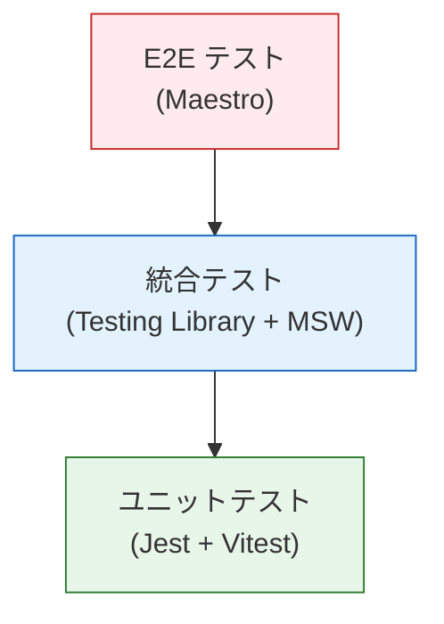

| テスト種類 | ツール | 対象 | カバレッジ目標 |
|-----------|-------|------|-------------|
| ユニットテスト | Jest | utils, validators, stores, hooks | 80% |
| 統合テスト | React Testing Library + MSW | コンポーネント + API連携 | 主要フロー |
| E2Eテスト | Maestro | 主要ユーザーフロー | クリティカルパス |

### 15.2 テスト対象（MVP）

| テスト | 内容 |
|-------|------|
| 認証フロー | 登録 → ログイン → ログアウト → 自動ログイン |
| 書籍登録フロー | 検索 → 選択 → 読書記録登録 |
| レビューフロー | レビュー作成 → 公開 → タイムライン表示 |
| SNSフロー | フォロー → いいね → コメント |
| バリデーション | フォーム入力の各バリデーションルール |

---

## 16. CI/CD パイプライン

### 16.1 パイプライン構成

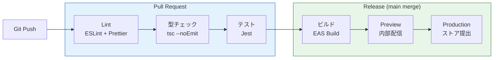

### 16.2 GitHub Actions ワークフロー

```yaml
# .github/workflows/ci.yml
name: CI
on:
  pull_request:
    branches: [main, develop]

jobs:
  lint-and-test:
    runs-on: ubuntu-latest
    steps:
      - uses: actions/checkout@v4
      - uses: actions/setup-node@v4
        with:
          node-version: 20
          cache: npm
      - run: npm ci
      - run: npm run lint
      - run: npm run typecheck
      - run: npm test -- --coverage
      - uses: codecov/codecov-action@v4
```

```yaml
# .github/workflows/release.yml
name: Release
on:
  push:
    branches: [main]

jobs:
  build:
    runs-on: ubuntu-latest
    steps:
      - uses: actions/checkout@v4
      - uses: actions/setup-node@v4
        with:
          node-version: 20
          cache: npm
      - uses: expo/expo-github-action@v8
        with:
          eas-version: latest
          token: ${{ secrets.EXPO_TOKEN }}
      - run: npm ci
      - run: eas build --platform all --profile production --non-interactive
```

### 16.3 EAS Build プロファイル

```json
// eas.json
{
  "cli": { "version": ">= 12.0.0" },
  "build": {
    "development": {
      "developmentClient": true,
      "distribution": "internal",
      "env": { "APP_ENV": "development" }
    },
    "preview": {
      "distribution": "internal",
      "env": { "APP_ENV": "staging" }
    },
    "production": {
      "env": { "APP_ENV": "production" },
      "autoIncrement": true
    }
  },
  "submit": {
    "production": {
      "ios": { "appleId": "your@email.com", "ascAppId": "123456789" },
      "android": { "serviceAccountKeyPath": "./google-services.json" }
    }
  }
}
```

---

## 17. パフォーマンス最適化戦略

| 対象 | 戦略 | 実装 |
|------|------|------|
| 画像表示 | 遅延読み込み + キャッシュ | `expo-image` の built-in キャッシュ |
| リスト描画 | 仮想化スクロール | `FlashList` (by Shopify) |
| APIリクエスト | キャッシュ + 楽観的更新 | TanStack Query の staleTime / optimistic updates |
| バンドルサイズ | ツリーシェイキング + 遅延インポート | `React.lazy()` + dynamic import |
| 再レンダリング | メモ化 | `React.memo`, `useMemo`, `useCallback` |
| 起動時間 | スプラッシュ中にデータプリフェッチ | `queryClient.prefetchQuery()` |
| フォント | サブセット化 | Google Fonts のサブセットURL使用 |
| オフライン | キャッシュファースト | TanStack Query の `networkMode: 'offlineFirst'` |

---

## 18. モニタリング・ログ収集

| ツール | 用途 | Phase |
|-------|------|-------|
| **Sentry** | エラートラッキング・クラッシュレポート | MVP |
| **Supabase Dashboard** | DB メトリクス・API利用状況 | MVP |
| **Expo Analytics** | OTAアップデートの成功率 | MVP |
| **Google Analytics (Firebase)** | ユーザー行動分析 | Phase 2 |

### 18.1 Sentry 設定

```typescript
// app/_layout.tsx
import * as Sentry from "@sentry/react-native";

Sentry.init({
  dsn: process.env.EXPO_PUBLIC_SENTRY_DSN,
  environment: process.env.EXPO_PUBLIC_APP_ENV,
  tracesSampleRate: 0.2,    // パフォーマンストレース（20%）
  enableAutoSessionTracking: true,
});
```

---

## 19. 環境構成

| 環境 | 用途 | Supabase | ビルド |
|------|------|----------|-------|
| `development` | ローカル開発 | ローカル (`supabase start`) | Expo Dev Client |
| `staging` | テスト・QA | Supabase クラウド（Staging プロジェクト） | EAS Preview |
| `production` | 本番 | Supabase クラウド（Production プロジェクト） | EAS Production |

### 19.1 環境変数切り替え

```typescript
// src/config/env.ts
const ENV = {
  development: {
    supabaseUrl: "http://localhost:54321",
    supabaseAnonKey: "eyJ...",
    sentryDsn: "",
  },
  staging: {
    supabaseUrl: "https://xxx.supabase.co",
    supabaseAnonKey: "eyJ...",
    sentryDsn: "https://xxx@sentry.io/xxx",
  },
  production: {
    supabaseUrl: "https://yyy.supabase.co",
    supabaseAnonKey: "eyJ...",
    sentryDsn: "https://yyy@sentry.io/yyy",
  },
} as const;

type AppEnv = keyof typeof ENV;
const currentEnv = (process.env.EXPO_PUBLIC_APP_ENV ?? "development") as AppEnv;

export const config = ENV[currentEnv];
```

---

## 20. 技術的判断事項

> [!IMPORTANT]
> 以下の判断事項について、開発開始前に確定が必要です。

| 判断事項 | 選択肢 | 推奨 | 理由 |
|---------|--------|------|------|
| BaaS | Firebase vs Supabase | **Supabase** | RDB, RLS, コスト面で個人開発に有利 |
| ルーティング | React Navigation vs Expo Router | **Expo Router** | ファイルベースで直感的、Deep Link対応が容易 |
| リスト描画 | FlatList vs FlashList | **FlashList** | パフォーマンスが大幅に良い |
| 画像ライブラリ | Image vs expo-image | **expo-image** | キャッシュ内蔵、WebP対応 |
| フォーム管理 | 手動 vs react-hook-form | **react-hook-form** | パフォーマンス良好、Zod統合が容易 |
| 型生成 | 手動 vs supabase gen types | **自動生成** | `supabase gen types typescript` でDB型を自動生成 |

---

> **次のステップ**: この技術設計書をレビューし、修正・加筆が必要な箇所があればお知らせください。承認後、プロジェクトのセットアップと実装に進みます。
