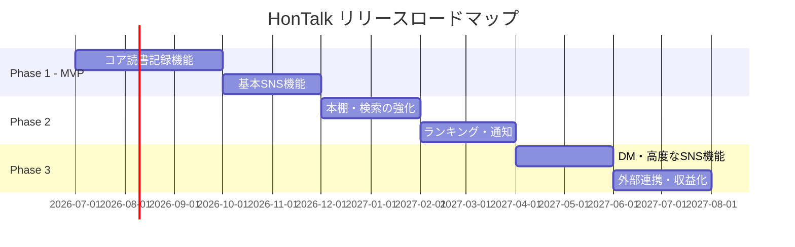
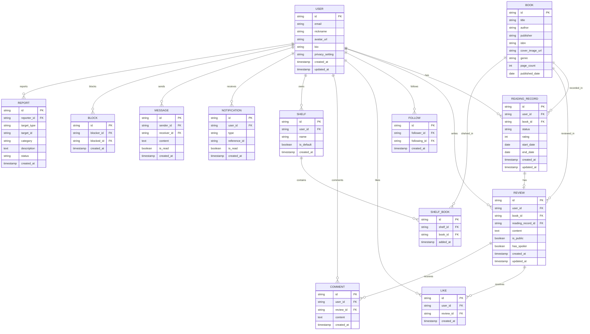

# 要件定義書 — HonTalk（本トーク）

> **SNS機能付き読書記録アプリ**
> ドキュメントバージョン: 1.0
> 作成日: 2026-06-26
> ステータス: ドラフト

---

## 1. プロジェクト概要

### 1.1 プロダクト名

**HonTalk（本トーク）** ※仮称

### 1.2 プロダクトビジョン

読書記録の管理とSNS機能を融合し、本を通じたコミュニケーションを生み出す読書記録プラットフォーム。ユーザーが読んだ本を記録・管理するだけでなく、レビューや感想を共有し、本好き同士がつながれる場を提供する。

### 1.3 ターゲットユーザー

| ペルソナ | 特徴 |
|---------|------|
| 読書好きな一般ユーザー | 幅広い年齢層、月に数冊〜十数冊の読書をする層 |

### 1.4 対応プラットフォーム

| プラットフォーム | 対応 | 備考 |
|----------------|------|------|
| iOS | ✅ | React Native (Expo) で開発 |
| Android | ✅ | React Native (Expo) で開発 |
| Web | ✅ | React Native for Web または別途Web版を開発 |

### 1.5 対応言語

- **初期リリース**: 日本語のみ
- **将来**: 多言語対応（英語など）を段階的に追加

---

## 2. リリース戦略

### 2.1 フェーズ概要

### 2.2 Phase 1 — MVP（最小限の製品）

**目標**: 読書記録の基本機能とSNS機能の核をリリースし、ユーザーの反応を検証する。

| カテゴリ | 機能 |
|---------|------|
| 読書記録 | 本の登録（タイトル、著者、表紙画像）、読書メモ・感想の記録、★5段階評価 |
| SNS | フォロー/フォロワー、タイムライン、レビューの公開・共有、いいね・コメント |
| 認証 | メール+パスワード、Googleログイン、Apple ID ログイン |
| 書籍データ | 外部API連携（Google Books API等）による検索・自動取得、手動入力 |

### 2.3 Phase 2 — 機能拡張

| カテゴリ | 機能 |
|---------|------|
| 読書記録 | 読書量の統計・グラフ表示（月別冊数、ジャンル別）|
| 本棚 | ジャンル別・カスタム本棚、本の検索・フィルタリング |
| SNS | ランキング（人気の本、話題のレビュー）、プッシュ通知 |
| 安全対策 | 通報・ブロック機能、ネタバレ防止、プロフィール公開範囲設定、ミュート |

### 2.4 Phase 3 — 高度な機能・収益化

| カテゴリ | 機能 |
|---------|------|
| SNS | ダイレクトメッセージ（DM）、本のおすすめ機能 |
| 外部連携 | X（旧Twitter）、Instagramへのシェア |
| 書籍データ | ISBNバーコードスキャン |
| 収益化 | 広告表示（無料ユーザー）、プレミアムプラン（広告非表示＋拡張機能） |

---

## 3. 機能要件

### 3.1 ユーザー認証・アカウント管理

#### FR-AUTH-001: ユーザー登録

| 項目 | 内容 |
|------|------|
| 概要 | 新規ユーザーがアカウントを作成できる |
| 認証方法 | メールアドレス+パスワード、Google OAuth、Apple ID (Sign in with Apple) |
| 入力項目 | メールアドレス、パスワード（8文字以上）、ニックネーム |
| バリデーション | メール形式チェック、パスワード強度チェック、ニックネーム重複チェック |
| 優先度 | 🔴 Must（MVP） |

#### FR-AUTH-002: ログイン / ログアウト

| 項目 | 内容 |
|------|------|
| 概要 | 登録済みユーザーがログイン・ログアウトできる |
| トークン管理 | JWT またはセッションベース認証 |
| 自動ログイン | リフレッシュトークンによるセッション維持 |
| 優先度 | 🔴 Must（MVP） |

#### FR-AUTH-003: プロフィール管理

| 項目 | 内容 |
|------|------|
| 概要 | ユーザーが自分のプロフィールを編集できる |
| 編集可能項目 | ニックネーム、プロフィール画像、自己紹介文、好きなジャンル |
| 公開範囲設定 | 公開 / フォロワーのみ / 非公開 |
| 優先度 | 🔴 Must（MVP）、公開範囲設定は Phase 2 |

---

### 3.2 書籍データ管理

#### FR-BOOK-001: 書籍検索・登録

| 項目 | 内容 |
|------|------|
| 概要 | ユーザーが本を検索し、読書記録として登録できる |
| 検索方法 | タイトル検索、著者名検索、ISBN検索 |
| 外部API | Google Books API、楽天ブックスAPI |
| 自動取得データ | タイトル、著者、出版社、出版日、表紙画像、ISBN、ジャンル、ページ数 |
| 手動入力 | API で見つからない場合、ユーザーが手動で情報を入力 |
| 優先度 | 🔴 Must（MVP） |

#### FR-BOOK-002: ISBNバーコードスキャン

| 項目 | 内容 |
|------|------|
| 概要 | カメラでISBNバーコードを読み取り、書籍情報を自動取得 |
| 使用ライブラリ | expo-camera / expo-barcode-scanner |
| 優先度 | 🟡 Want（Phase 3） |

---

### 3.3 読書記録機能

#### FR-REC-001: 読書ステータス管理

| 項目 | 内容 |
|------|------|
| 概要 | 登録した本の読書ステータスを管理できる |
| ステータス | 読みたい → 読書中 → 読了 |
| 記録データ | 読書開始日、読了日 |
| 優先度 | 🔴 Must（MVP） |

#### FR-REC-002: 読書メモ・感想の記録

| 項目 | 内容 |
|------|------|
| 概要 | 本に対してメモや感想を記録できる |
| 入力形式 | リッチテキスト（太字、箇条書き等の基本的な書式対応） |
| 公開設定 | 公開 / 非公開を選択可能 |
| 文字数制限 | 最大 5,000 文字 |
| 優先度 | 🔴 Must（MVP） |

#### FR-REC-003: 評価・レーティング

| 項目 | 内容 |
|------|------|
| 概要 | 読了した本に★5段階で評価をつけられる |
| 入力方法 | ★1〜★5のタップ / スワイプ操作 |
| 表示 | 自分の評価 + 全ユーザーの平均評価 |
| 優先度 | 🔴 Must（MVP） |

#### FR-REC-004: 読書量の統計・グラフ表示

| 項目 | 内容 |
|------|------|
| 概要 | ユーザーの読書量を可視化する |
| 統計データ | 月別読了冊数、ジャンル別読了冊数、年間読了冊数推移 |
| 表示形式 | 棒グラフ、円グラフ、折れ線グラフ |
| 使用ライブラリ | react-native-chart-kit 等 |
| 優先度 | 🟠 Should（Phase 2） |

---

### 3.4 本棚機能

#### FR-SHELF-001: 本棚の管理

| 項目 | 内容 |
|------|------|
| 概要 | ユーザーが本を分類して本棚にまとめられる |
| デフォルト本棚 | 「読みたい」「読書中」「読了」 |
| カスタム本棚 | ユーザーが自由に本棚を作成・命名可能 |
| ジャンル別自動分類 | 書籍データのジャンル情報から自動分類 |
| 優先度 | 🟠 Should（Phase 2） |

#### FR-SHELF-002: 本の検索・フィルタリング

| 項目 | 内容 |
|------|------|
| 概要 | 登録済みの本を検索・フィルタリングできる |
| フィルター条件 | ステータス、ジャンル、評価、著者、登録日、本棚 |
| ソート | 登録日順、評価順、タイトル順 |
| 優先度 | 🟠 Should（Phase 2） |

---

### 3.5 SNS機能

#### FR-SNS-001: フォロー / フォロワー

| 項目 | 内容 |
|------|------|
| 概要 | 他のユーザーをフォローし、読書活動をウォッチできる |
| フォロー制限 | 特になし（将来的に上限設定を検討） |
| フォロー通知 | フォローされた際にプッシュ通知 |
| 優先度 | 🔴 Must（MVP） |

#### FR-SNS-002: タイムライン

| 項目 | 内容 |
|------|------|
| 概要 | フォローしているユーザーの読書活動が時系列で表示される |
| 表示コンテンツ | レビュー投稿、本の登録、評価、読了報告 |
| ソート | 新しい順（時系列） |
| リフレッシュ | プルダウンリフレッシュ対応 |
| ページネーション | 無限スクロール（カーソルベース） |
| 優先度 | 🔴 Must（MVP） |

#### FR-SNS-003: レビュー・感想の公開と共有

| 項目 | 内容 |
|------|------|
| 概要 | 読書メモ・感想をレビューとしてタイムラインに公開できる |
| ネタバレ設定 | 「ネタバレあり」フラグを設定可能（閲覧時にワンクッション） |
| 表示 | レビュー一覧から本の詳細ページへ遷移可能 |
| 優先度 | 🔴 Must（MVP） |

#### FR-SNS-004: いいね・コメント

| 項目 | 内容 |
|------|------|
| 概要 | レビューや読書記録に対して「いいね」やコメントができる |
| いいねの種類 | 1種類（❤️） |
| コメント | テキストのみ、最大 500 文字 |
| 通知 | いいね・コメントがあった際にプッシュ通知 |
| 優先度 | 🔴 Must（MVP） |

#### FR-SNS-005: 本のおすすめ機能

| 項目 | 内容 |
|------|------|
| 概要 | ユーザーが他のユーザーに本をおすすめできる |
| おすすめ方法 | 特定のユーザーに対しておすすめリストを作成・送信 |
| 表示 | おすすめされた本の一覧を通知・マイページから確認 |
| 優先度 | 🟡 Want（Phase 3） |

#### FR-SNS-006: ダイレクトメッセージ（DM）

| 項目 | 内容 |
|------|------|
| 概要 | ユーザー間で1対1のメッセージを送受信できる |
| メッセージ形式 | テキストのみ（最大 2,000 文字） |
| 既読表示 | 既読/未読のステータス表示 |
| DM制限 | フォローしているユーザー同士のみ送受信可能（設定変更可） |
| 優先度 | 🟡 Want（Phase 3） |

#### FR-SNS-007: ランキング

| 項目 | 内容 |
|------|------|
| 概要 | 人気の本や話題のレビューをランキング形式で表示 |
| ランキング種類 | 週間/月間の人気書籍、話題のレビュー、注目のユーザー |
| 算出ロジック | いいね数、レビュー数、登録数の加重スコア |
| 優先度 | 🟠 Should（Phase 2） |

---

### 3.6 通知機能

#### FR-NOTIF-001: プッシュ通知

| 項目 | 内容 |
|------|------|
| 概要 | 各種アクティビティに対してプッシュ通知を送信する |
| 通知トリガー | いいね、コメント、フォロー、おすすめ、DM受信 |
| 通知設定 | ユーザーが通知の種類ごとにON/OFFを設定可能 |
| 実装 | Firebase Cloud Messaging (FCM) / Apple Push Notification Service (APNs) |
| 優先度 | 🟠 Should（Phase 2） |

#### FR-NOTIF-002: アプリ内通知

| 項目 | 内容 |
|------|------|
| 概要 | アプリ内で通知一覧を確認できる |
| 表示 | 未読/既読の区別、バッジ表示 |
| 優先度 | 🔴 Must（MVP） |

---

### 3.7 外部連携

#### FR-EXT-001: 外部SNSシェア

| 項目 | 内容 |
|------|------|
| 概要 | レビューや読書記録を外部SNSにシェアできる |
| 対応SNS | X（旧Twitter）、Instagram |
| シェア内容 | 書籍情報 + レビュー抜粋 + アプリリンク |
| OGP対応 | シェアリンクに書籍の表紙画像・タイトルがプレビュー表示 |
| 優先度 | 🟡 Want（Phase 3） |

---

### 3.8 安全対策・モデレーション

#### FR-SAFE-001: 通報・ブロック機能

| 項目 | 内容 |
|------|------|
| 概要 | 不適切なコンテンツやユーザーを通報・ブロックできる |
| 通報カテゴリ | スパム、不適切な内容、ハラスメント、その他 |
| ブロック効果 | ブロックしたユーザーの投稿の非表示、DMの制限 |
| 優先度 | 🟠 Should（Phase 2） |

#### FR-SAFE-002: ネタバレ防止機能

| 項目 | 内容 |
|------|------|
| 概要 | 未読の本のレビューがネタバレにならないように保護する |
| 仕組み | 「ネタバレあり」フラグ付きレビューは初期表示時に内容を隠す |
| 解除方法 | ユーザーが「ネタバレを表示する」ボタンをタップで表示 |
| 優先度 | 🟠 Should（Phase 2） |

#### FR-SAFE-003: プロフィール公開範囲設定

| 項目 | 内容 |
|------|------|
| 概要 | プロフィール情報や読書記録の公開範囲を設定できる |
| 公開範囲 | 公開（全員） / フォロワーのみ / 非公開 |
| 対象 | プロフィール情報、読書記録、本棚、統計情報 |
| 優先度 | 🟠 Should（Phase 2） |

#### FR-SAFE-004: ミュート機能

| 項目 | 内容 |
|------|------|
| 概要 | 特定ユーザーの投稿をタイムラインから非表示にする |
| 効果 | ミュート対象のレビュー・アクティビティがタイムラインに表示されない |
| ミュート管理 | ミュートリストの表示・解除が可能 |
| 優先度 | 🟠 Should（Phase 2） |

---

## 4. 非機能要件

### 4.1 パフォーマンス

| 項目 | 要件 |
|------|------|
| API レスポンスタイム | 95パーセンタイルで 500ms 以内 |
| アプリ起動時間 | コールドスタート 3秒以内 |
| タイムライン読み込み | 初回表示 2秒以内（キャッシュなし時） |
| 画像読み込み | プログレッシブローディング + キャッシュ対応 |
| オフライン対応 | 読書記録の閲覧はオフラインでも可能（キャッシュ） |

### 4.2 セキュリティ

| 項目 | 要件 |
|------|------|
| 通信 | 全通信 HTTPS 必須 |
| 認証トークン | JWT / セッショントークンのセキュアストレージ保存 |
| パスワード | ハッシュ化保存（bcrypt等） |
| 個人情報保護 | プライバシーポリシーの策定と同意取得 |
| GDPR / 個人情報保護法 | ユーザーデータの削除リクエスト対応 |
| レート制限 | API に対するレート制限を設定 |

### 4.3 スケーラビリティ

| 項目 | 要件 |
|------|------|
| 初期想定ユーザー数 | 〜10,000 人 |
| スケール目標 | 100,000 人規模まで対応可能な設計 |
| データベース設計 | 水平スケーリング可能な設計 |

### 4.4 可用性・信頼性

| 項目 | 要件 |
|------|------|
| 稼働率目標 | 99.5% 以上 |
| バックアップ | データベースの日次自動バックアップ |
| エラーハンドリング | ユーザーフレンドリーなエラーメッセージ表示 |

### 4.5 保守性

| 項目 | 要件 |
|------|------|
| コード品質 | ESLint / Prettier による統一的なコードスタイル |
| テスト | ユニットテスト + 統合テストの整備 |
| CI/CD | 自動ビルド・テスト・デプロイパイプラインの構築 |
| ログ | アプリケーションログの収集・監視（Crashlytics等） |

---

## 5. 技術スタック

### 5.1 フロントエンド

| 技術 | 用途 |
|------|------|
| **React Native (Expo)** | iOS / Android / Web のクロスプラットフォーム開発 |
| **TypeScript** | 型安全な開発 |
| **React Navigation** | 画面遷移・ナビゲーション管理 |
| **Expo Router** | ファイルベースルーティング（代替候補） |
| **React Query (TanStack Query)** | サーバーステート管理・キャッシュ |
| **Zustand** | クライアントステート管理 |

### 5.2 バックエンド

| 技術 | 用途 |
|------|------|
| **Firebase** または **Supabase** | BaaS（認証・DB・ストレージ・リアルタイム通信） |
| **Firestore** / **PostgreSQL** | データベース |
| **Firebase Auth** / **Supabase Auth** | ユーザー認証 |
| **Cloud Storage** / **Supabase Storage** | 画像ストレージ（プロフィール画像、書籍カバー） |
| **Cloud Functions** / **Edge Functions** | サーバーレス関数（通知送信、ランキング計算等） |

### 5.3 外部サービス

| サービス | 用途 |
|---------|------|
| **Google Books API** | 書籍データの検索・取得 |
| **楽天ブックスAPI** | 日本の書籍データ補完 |
| **Firebase Cloud Messaging (FCM)** | プッシュ通知 |
| **Apple Push Notification Service (APNs)** | iOS プッシュ通知 |

### 5.4 開発ツール・インフラ

| ツール | 用途 |
|-------|------|
| **Git / GitHub** | バージョン管理 |
| **EAS (Expo Application Services)** | ビルド・配信 |
| **GitHub Actions** | CI/CD |
| **Crashlytics** | クラッシュレポート |
| **Sentry** | エラーモニタリング（代替候補） |

---

## 6. データモデル（概要）

---

## 7. 画面一覧（主要画面）

| 画面名 | 概要 | Phase |
|--------|------|-------|
| スプラッシュ画面 | アプリ起動時のブランディング表示 | MVP |
| ログイン / 新規登録画面 | 認証画面（メール、Google、Apple） | MVP |
| ホーム画面（タイムライン） | フォローユーザーのアクティビティ一覧 | MVP |
| 書籍検索画面 | 本の検索・登録画面 | MVP |
| 書籍詳細画面 | 本の詳細情報・レビュー一覧 | MVP |
| 読書記録編集画面 | ステータス、メモ、評価の入力 | MVP |
| プロフィール画面 | ユーザー情報・読書記録一覧 | MVP |
| 本棚画面 | カスタム本棚の表示・管理 | Phase 2 |
| 統計画面 | 読書量のグラフ・統計表示 | Phase 2 |
| ランキング画面 | 人気の本・レビューランキング | Phase 2 |
| 通知画面 | 通知一覧の表示 | MVP (アプリ内) |
| 設定画面 | 通知設定、プライバシー設定、アカウント管理 | MVP |
| DM画面 | メッセージの送受信 | Phase 3 |

---

## 8. 収益化モデル

### 8.1 広告モデル

| 項目 | 内容 |
|------|------|
| 広告プラットフォーム | Google AdMob |
| 広告種類 | バナー広告（タイムラインフッター）、インタースティシャル広告（低頻度） |
| 表示対象 | 無料ユーザーのみ |
| 配慮事項 | 読書体験を妨げない自然な配置 |

### 8.2 プレミアムプラン

| 項目 | 内容 |
|------|------|
| 価格 | 月額 ¥300〜500（要市場調査） |
| 特典 | 広告非表示、統計の詳細表示、カスタム本棚の上限拡張、プロフィールカスタマイズ |
| 決済 | App Store / Google Play のアプリ内課金 |

---

## 9. デザイン方針

| 項目 | 方針 |
|------|------|
| テーマ | 明るいモダンデザイン（ライトモード基調） |
| カラーパレット | 温かみのあるアクセントカラー（読書をイメージ）+ クリーンなベース色 |
| タイポグラフィ | 可読性重視。Noto Sans JP ベース |
| アイコン | 統一感のあるアイコンセット（Lucide Icons 等） |
| アニメーション | 自然で心地よいマイクロアニメーション |
| レスポンシブ | モバイルファースト設計、タブレット・Web にも適応 |

---

## 10. 開発体制・運用

### 10.1 開発体制

| 項目 | 内容 |
|------|------|
| 体制 | 個人開発（1名） |
| 開発手法 | アジャイル（1〜2週間スプリント） |
| タスク管理 | GitHub Issues + GitHub Projects |

### 10.2 リリース目標

| マイルストーン | 内容 | 目標時期 |
|------------|------|---------|
| MVP リリース | コア機能の完成・テストフライト配信 | 未定（期限なし） |
| Phase 2 | 機能拡張・安全対策 | MVP後 |
| Phase 3 | 高度な機能・収益化 | Phase 2後 |

---

## 11. リスクと対策

| リスク | 影響度 | 対策 |
|--------|-------|------|
| 個人開発によるリソース不足 | 高 | MVPスコープを最小限に絞り段階的リリース |
| 外部API（Google Books等）の制限・停止 | 中 | 複数APIの併用、キャッシュ戦略の整備 |
| 不適切コンテンツの増加 | 中 | Phase 2で通報・ブロック機能を優先実装 |
| ユーザー獲得の困難 | 高 | 外部SNSシェア機能、口コミ促進、ASO対策 |
| データ漏洩・セキュリティインシデント | 高 | BaaS活用による認証セキュリティ確保、定期的なセキュリティレビュー |

---

## 付録

### A. 用語集

| 用語 | 説明 |
|------|------|
| MVP | Minimum Viable Product（実用最小限の製品） |
| BaaS | Backend as a Service |
| OGP | Open Graph Protocol（SNSシェア時のプレビュー表示） |
| ASO | App Store Optimization（アプリストア最適化） |
| FCM | Firebase Cloud Messaging |
| APNs | Apple Push Notification Service |

### B. 参考サービス

| サービス名 | 参考ポイント |
|-----------|-------------|
| 読書メーター | 読書記録・コミュニティ機能 |
| ブクログ | 本棚UI・レビュー機能 |
| Goodreads | 読書SNSの世界標準 |
| Storygraph | 統計・可視化のアプローチ |

---

> **次のステップ**: この要件定義書をレビューし、修正・加筆が必要な箇所があればお知らせください。承認後、技術設計（アーキテクチャ設計書）の作成に進みます。
